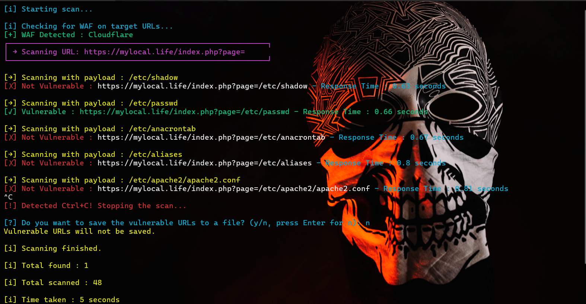

# LFI Testing Tool

This is a command-line tool for testing Local File Inclusion (LFI) vulnerabilities on target URLs. It support checking multiple URLs with configurable payloads, detecting WAF (Web Application Firewall), and saving the results of discovered vulnerabilities to a file.

## Features 
- **LFI Vulnerability Testing**: Tests URLs for Local File Inclusion (LFI) vulnerabilities using various payloads.
- **WAF Detection**: Detects Web Application Firewalls (WAF) to adjust the scanning process accordingly.
- **Multithreaded Scanning**: Uses multiple threads to scan URLs faster.
- **Result Saving**: Allows saving discovered vulnerable URLs to a file.
- **Customizable Payloads**: can load custom payloads.



### Installation 
- **Clone the repository**
```bash 
git clone https://github.com/lfi_scanner/mylfi.git
```

```bash
cd mylfi
```
<!-- 
- **Install the required dependencies** 
```bash
pip install -r requirements.txt
``` -->

### Requirements 
Before running the tool, ensure that you have installed required packages.

You can install these packages by running : 

```bash 
pip install -r requirements.txt
```

## Usage

```bash
python3 mylfi.py
```


### Disclaimer

- This tool is intended for educational purposes and authorized penetration testing only. Unauthorized usage is prohibited and may result in legal consequences.
